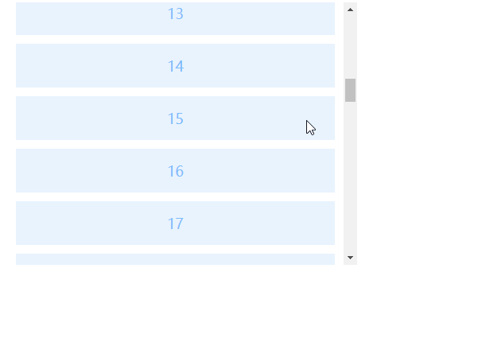

# vue-loading-more

# 介绍
  一款基于vue的视口交叉监控组件[加载更多]。

# 样例




# 开始

```javascript
npm install vue-loading-more
```

# 使用
```javascript
import VueLoadingMore from 'vue-loading-more';
Vue.use(VueLoadingMore)
  ```

# option参数说明
  |  名称   | 是否必填  | 类型  |默认值| 说明        |
  |  ----   |  ----   | ----  | ----  | ----      |
  | threshold|   否   |  number | 0.5 |  交叉阈值（0-1） |

  
# 事件说明
  |  名称   |  说明        |
  |  ----   |  ----      |
  | intersect|  监控目标元素与视口相交触发 |

# 样例

```javascript
 <VueLoadingMore
    :threshold="threshold"
    @intersect="handleIntersect">
      <span>加载更多</span>  
  </VueLoadingMore>
  ```